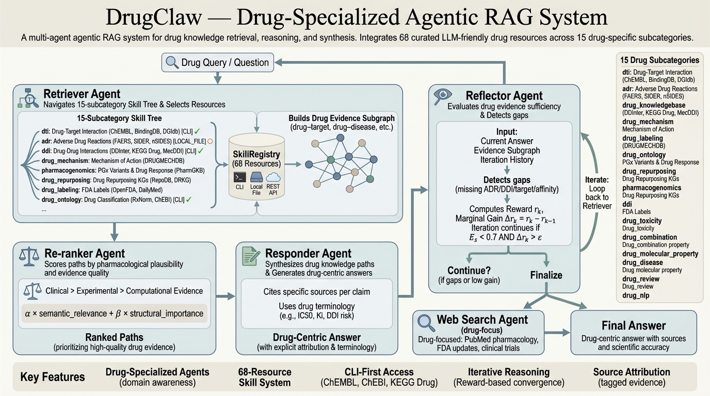

# DrugClaw

<p align="center">
  
</p>

<p align="center">
  <strong>Drug-Specialized Agentic RAG for Retrieval, Reasoning, and Evidence Synthesis</strong>
</p>

<p align="center">
  面向药物知识检索、推理与证据综合的多智能体系统
</p>

<p align="center">
  
  
  
  
</p>

DrugClaw is a drug-centered agentic RAG system built for questions that generic assistants handle poorly: drug-target interactions, adverse events, drug-drug interactions, mechanism-of-action, pharmacogenomics, repurposing, labeling, and evidence synthesis across heterogeneous biomedical sources.

DrugClaw 是一个面向药物领域的 Agentic RAG 系统，专门处理通用助手经常答不深、答不稳的问题，例如药物靶点、药物不良反应、药物相互作用、作用机制、药物基因组学、药物重定位，以及跨异构生物医学资源的证据综合。

## Why DrugClaw / 为什么是 DrugClaw

Most biomedical QA systems stop at "retrieve a few documents and summarize them." DrugClaw goes further:

大多数生物医学问答系统停留在“检索几段文本然后总结”的层面，DrugClaw 更进一步：

- It organizes **68 curated drug resources** into a navigable **15-subcategory skill tree**.
- It uses a **Code Agent** to write resource-specific query code instead of forcing every source into one rigid schema.
- It supports **structured graph reasoning** for multi-hop drug evidence synthesis.
- It keeps **web search** as a live fallback for recent literature and broad external evidence.
- It is built for **drug-native tasks**, not generic retrieval with a biomedical prompt wrapper.

- 将 **68 个药物资源**组织为可导航的 **15 类技能树**。
- 用 **Code Agent** 为每个资源现写查询代码，而不是强行套进单一死板接口。
- 支持 **图结构推理**，适合多跳药物证据综合。
- 保留 **Web Search** 作为最新文献和外部证据的补充通道。
- 从设计上就是为 **药物原生任务** 服务，而不是“通用 RAG + 生物医学提示词”。

## Highlights / 核心亮点

### 1. Vibe-Coding Retrieval

Each skill ships with its own `SKILL.md` and `example.py`. The Code Agent reads both, understands the native access pattern, generates custom Python query code, executes it, and captures the output.

每个 skill 都带有自己的 `SKILL.md` 和 `example.py`。Code Agent 会读取这两份材料，理解资源原生调用方式，自动生成针对当前问题的查询代码并执行。

### 2. Drug-Native Skill Coverage

DrugClaw currently exposes **25 implemented skills** across:

- Drug-target interaction
- Adverse drug reaction
- Drug knowledgebase
- Drug mechanism
- Drug labeling
- Drug ontology
- Drug repurposing
- Pharmacogenomics
- Drug-drug interaction
- Drug review

DrugClaw 当前已落地 **25 个可用 skill**，覆盖：

- 药物靶点与活性
- 不良反应与药物警戒
- 药物知识库
- 药物机制
- 药品标签与说明书
- 药物本体与标准化
- 药物重定位
- 药物基因组学
- 药物相互作用
- 患者评价

### 3. Three Thinking Modes

- `GRAPH`: retrieve -> build graph -> rerank -> respond -> reflect
- `SIMPLE`: retrieve -> answer directly
- `WEB_ONLY`: use live web and literature search only

- `GRAPH`：检索 -> 建图 -> 重排 -> 作答 -> 反思
- `SIMPLE`：检索后直接作答
- `WEB_ONLY`：只走在线检索和文献搜索

### 4. Built for Evidence Synthesis

DrugClaw is designed to answer queries like:

- "What are the known targets, adverse effects, and interaction risks of imatinib?"
- "Which approved drugs may be repurposed for triple-negative breast cancer?"
- "What pharmacogenomic guidance exists for clopidogrel and CYP2C19?"
- "Are there clinically meaningful interactions between warfarin and NSAIDs?"

DrugClaw 适合回答的问题包括：

- “伊马替尼已知的靶点、不良反应和相互作用风险有哪些？”
- “哪些已批准药物可能重定位到三阴性乳腺癌？”
- “氯吡格雷与 CYP2C19 有哪些药物基因组学建议？”
- “华法林与 NSAIDs 之间是否存在临床上重要的相互作用？”

## Architecture / 架构

```text
Drug Query
   |
   v
Retriever Agent
   |- navigates the 15-subcategory skill tree
   |- extracts key entities
   |- selects relevant skills
   |
   v
Code Agent
   |- reads SKILL.md + example.py
   |- writes custom Python query code
   |- executes resource-specific retrieval
   |
   +--> SIMPLE mode --> Responder --> Final Answer
   |
   +--> GRAPH mode
         -> Graph Builder
         -> Reranker
         -> Responder
         -> Reflector
         -> optional Web Search
         -> Final Answer
```

```text
用户问题
   |
   v
Retriever Agent
   |- 浏览 15 类技能树
   |- 抽取关键实体
   |- 选择合适资源
   |
   v
Code Agent
   |- 读取 SKILL.md + example.py
   |- 生成定制查询代码
   |- 执行资源特定检索
   |
   +--> SIMPLE 模式 --> Responder --> 最终回答
   |
   +--> GRAPH 模式
         -> Graph Builder
         -> Reranker
         -> Responder
         -> Reflector
         -> 可选 Web Search
         -> 最终回答
```

## Implemented Skills / 已实现技能

| Category | Skills |
| --- | --- |
| DTI | ChEMBL, BindingDB, DGIdb, Open Targets Platform, TTD, STITCH |
| ADR | FAERS, SIDER |
| Knowledgebase | UniD3, DrugBank, IUPHAR/BPS Guide to Pharmacology, DrugCentral, CPIC |
| Mechanism | DRUGMECHDB |
| Labeling | openFDA Human Drug, DailyMed, MedlinePlus Drug Info |
| Ontology | RxNorm, ChEBI |
| Repurposing | RepoDB |
| Pharmacogenomics | PharmGKB |
| DDI | MecDDI, DDInter, KEGG Drug |
| Review | WebMD Drug Reviews |

Plus `WebSearch` for DuckDuckGo + PubMed style external retrieval.

另有 `WebSearch` 用于 DuckDuckGo + PubMed 风格的外部检索补充。

## Quick Start / 快速开始

### 1. Install / 安装

```bash
pip install langgraph openai

# Optional CLI dependencies for selected skills
pip install chembl_webresource_client
pip install libchebipy
pip install bioservices
```

### 2. Prepare API keys / 准备 API Key

Create `navigator_api_keys.json`:

创建 `navigator_api_keys.json`：

```json
{
  "OPENAI_API_KEY": "your-api-key-here",
  "base_url": "https://your-endpoint.com/v1"
}
```

Important:

- The current default path in `drugclaw/config.py` points to the original author's environment.
- In your own environment, pass the local key file explicitly.

注意：

- 当前 `drugclaw/config.py` 里的默认 key 路径指向作者原始环境。
- 在你自己的环境里，建议显式传入本地 key 文件路径。

### 3. Run a query / 运行查询

```python
from drugclaw.config import Config
from drugclaw.main_system import DrugClawSystem
from drugclaw.models import ThinkingMode

config = Config(key_file="navigator_api_keys.json")
system = DrugClawSystem(config)

result = system.query(
    "What are the known drug targets and adverse effects of imatinib?",
    thinking_mode=ThinkingMode.GRAPH,
)

print(result["answer"])
```

### 4. Try different modes / 尝试不同模式

```python
from drugclaw.models import ThinkingMode

system.query("...", thinking_mode=ThinkingMode.GRAPH)
system.query("...", thinking_mode=ThinkingMode.SIMPLE)
system.query("...", thinking_mode=ThinkingMode.WEB_ONLY)
```

### 5. Pin specific skills / 指定资源检索

```python
result = system.query(
    "What are the adverse effects of aspirin?",
    resource_filter=["FAERS", "SIDER"],
)
```

## Repository Layout / 仓库结构

```text
drugclaw/
  config.py
  main_system.py
  llm_client.py
  agent_retriever.py
  agent_coder.py
  agent_graph_builder.py
  agent_reranker.py
  agent_responder.py
  agent_reflector.py
  agent_websearch.py

skills/
  <subcategory>/<skill_name>/
    *_skill.py
    example.py
    SKILL.md
    README.md

resources_metadata/
  local data for dataset and file-based skills
```

## What Makes It Different / 差异化优势

### Resource-native querying instead of forced abstraction

DrugClaw does not require every biomedical source to behave like the same database.

DrugClaw 不要求每个生物医学资源都伪装成同一种数据库接口。

### Agentic graph reasoning instead of flat summarization

DrugClaw can transform free-form retrieval output into triples, subgraphs, ranked paths, and evidence-aware answers.

DrugClaw 可以把自由文本检索结果进一步转成三元组、子图、路径排序和基于证据的回答，而不只是平铺式总结。

### Drug-specialized scope instead of generic biomedical branding

This system is opinionated around drug tasks: DTI, ADR, DDI, labeling, repurposing, PGx, and mechanism reasoning.

这个系统不是泛泛的“生物医学助手”，而是明确围绕药物任务构建：DTI、ADR、DDI、标签、重定位、PGx 与机制推理。

## Current Notes / 当前说明

- The repository already imports correctly from the workspace root.
- Packaging metadata in `pyproject.toml` is not yet fully aligned with the current directory layout.
- Some skills require local files under `resources_metadata/`.
- Some default config paths still reflect the original development machine.

- 当前仓库在项目根目录下可直接导入运行。
- `pyproject.toml` 的打包配置与当前目录结构还没有完全对齐。
- 部分 skill 依赖 `resources_metadata/` 下的本地数据文件。
- 部分默认配置路径仍然保留作者开发机路径。

## Citation / 引用

If you use DrugClaw in research or product work, please cite the repository and the original upstream data resources used by the selected skills.

如果你在科研或产品中使用 DrugClaw，请同时引用本仓库以及对应 skill 所使用的原始上游数据资源。

## License / 许可证

MIT License
